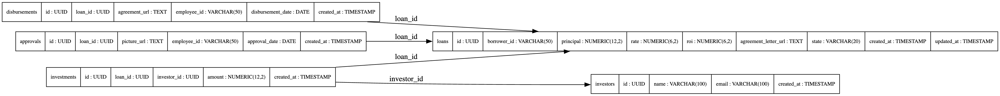

# Amartha Loan Service

This repository implements a simple yet scalable loan management
service for Amartha. It addresses the third problem from the Amartha
engineering code test – designing a RESTful API for a loan engine. The
system is written in Go using the [Gin](https://github.com/gin-gonic/gin)
HTTP framework and [GORM](https://gorm.io) ORM library for PostgreSQL
storage. The architecture is layered (handler → service → repository)
for clarity and testability. Each component has a single
responsibility: handlers translate HTTP requests into service calls,
services enforce business rules and orchestrate workflows, and
repositories encapsulate database access.

## Features

* **Stateful loans** – loans move forward through the `proposed`,
  `approved`, `invested` and `disbursed` states. Backward transitions
  are prohibited.
* **Approval flow** – staff can approve a proposed loan by
  submitting a picture proof, their employee ID and the approval
  date. A loan can only be approved once.
* **Investments** – one or more investors may invest in an approved
  loan. The system records each investment separately, aggregates
  totals and prevents over‑funding. When the principal is fully
  raised the loan automatically moves to the `invested` state.
* **Disbursement** – once fully funded, loans may be disbursed. A
  signed agreement letter, the responsible employee and the date of
  disbursement are stored. After disbursement the loan enters the
  final `disbursed` state.
* **PostgreSQL schema and migrations** – a migration file
  (`migrations/001_create_tables.sql`) defines all tables,
  constraints and indexes. UUIDs are used as primary keys for
  scalability. The `docs/schema.dot` file contains a Graphviz
  description of the entity relationships. This diagram can be
  rendered with the `dot` tool: `dot -Tpng docs/schema.dot -o
  docs/schema.png`.
* **Dockerised setup** – the service and its database run in
  isolated containers via `docker-compose`. Simply run `docker
  compose up --build` to start the stack.

## Getting Started

1. **Clone this repository** (or extract it from the provided ZIP).
2. Ensure you have [Docker](https://docs.docker.com/get-docker/) and
   [Docker Compose](https://docs.docker.com/compose/) installed.
3. Build and start the services:

   ```bash
   docker compose up --build
   ```

   This spins up a PostgreSQL database and the Go service. The API
   listens on `localhost:8080` and the database on `localhost:5432`.
4. Interact with the API using `curl`, Postman or any HTTP client.

### Run Unit Test

```bash
# from the project root (where go.mod lives)
go test ./... -v
```

### API Examples

Create a loan:

```bash
curl -X POST http://localhost:8080/loans -H 'Content-Type: application/json' -d '{"borrower_id": "12345", "principal": 5000000, "rate": 10, "roi": 8, "agreement_letter_url": "https://example.com/agreement.pdf"}'
```

List all Loan: 

```bash 
curl -X GET http://localhost:8080/loans
```

Get Loan by id: 

```bash 
curl -X GET http://localhost:8080/loans/3048bda6-ce51-474e-be1f-7a55ed6191b8
```

Approve the loan:

```bash
curl -X POST http://localhost:8080/loans/<loanID>/approve -H 'Content-Type: application/json' -d '{"picture_url": "https://example.com/proof.jpg", "employee_id": "EMP001", "approval_date": "2025-08-15T00:00:00Z"}'
```

Invest in the loan:

```bash
curl -X POST http://localhost:8080/loans/<loanID>/invest -H 'Content-Type: application/json' -d '{"investor_name": "Alice", "investor_email": "alice@example.com","amount": 2500000 }'
```

Disburse the loan once fully funded:

```bash
curl -X POST http://localhost:8080/loans/<loanID>/disburse -H 'Content-Type: application/json' -d '{"agreement_url": "https://example.com/signed-agreement.pdf","employee_id": "EMP002", "disbursement_date": "2025-08-20T00:00:00Z" }'
```

### Database Schema Diagram

The diagram below illustrates the database schema. Each table uses a
UUID primary key; relationships are shown with arrows.



## Design Considerations

* **Layered architecture** – code is organised into `domain`,
  `repository`, `service` and `handler` packages. This separation
  improves maintainability and testability.
* **Scalability** – UUID primary keys permit horizontal scaling and
  distributed systems without coordination. The Dockerised setup
  allows the service to run in multiple instances behind a load
  balancer. Business logic resides in the service layer, making it
  straightforward to add caching or queues in the future.
* **Avoiding idempotency** – operations intentionally record every
  action. Each call to the invest endpoint creates a new investment
  record, even if the same investor invests multiple times. Approvals
  and disbursements are prevented from being executed more than once
  through database uniqueness constraints and explicit state checks.

## Notes

* The project uses GORM’s auto‑migration for convenience in the
  development environment. For production deployments consider
  applying the SQL migration manually to ensure repeatable and
  idempotent schema changes.
* Emailing investors upon loan funding is simulated with a log
  statement. In a real application this would call an email service.
